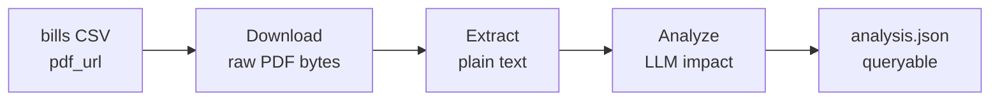

# Pipeline — Overview

The pipeline transforms a discovered bill URL into a structured, queryable impact analysis. Each stage is idempotent — it checks whether its output artifact already exists before doing work, making re-runs safe.

## Stages



| Stage | Input | Output | Module |
|-------|-------|--------|--------|
| [Download](download.md) | `pdf_url` from bills CSV | `data/raw/<adapter>/pdf/<year>/<bill_id>.pdf` + `.meta.json` | `lib.pipeline.download` |
| [Extract](extract.md) | Raw PDF path | `data/derived/<adapter>/extracted/<year>/<bill_id>/text.txt` | `lib.pipeline.extract` |
| [Analyze](analyze.md) | Extracted text + bill metadata | `data/derived/<adapter>/analyzed/<year>/<bill_id>/analysis.json` | `lib.pipeline.analyze` |

## Idempotency

The bill's natural key (`<year>/<bill_id>`) determines the artifact path. Each stage checks whether its output file exists before running — if it does, the bill is skipped. SHA-256 is stored in `.meta.json` alongside the PDF for change-detection purposes, not in the path.

Pass `--force` to any stage to overwrite existing artifacts.

## Running the pipeline

```bash
# Full pipeline — 20 bills per run
PYTHONPATH=src python -m lib.pipeline.run --source parliament_my --max 20

# Individual stages
PYTHONPATH=src python -m lib.pipeline.download --source parliament_my --max 50
PYTHONPATH=src python -m lib.pipeline.extract  --source parliament_my
PYTHONPATH=src python -m lib.pipeline.analyze  --source parliament_my --max 10
```

## Failure handling

Each stage catches per-item failures and continues. Failures are logged to `crawl_history` with `outcome=error` and an `error_message`. The batch never aborts for a single bad bill.

Suspect PDFs (< 100 chars of extracted text — likely scanned image) are marked with a `suspect.txt` marker file and skipped by the LLM stage; flagged for human review.
