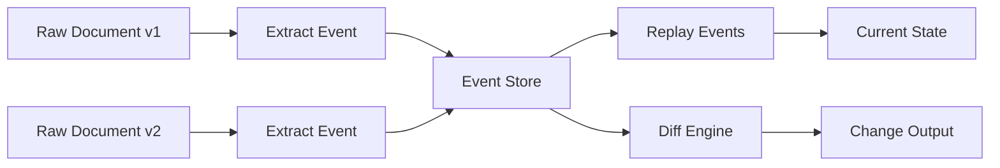
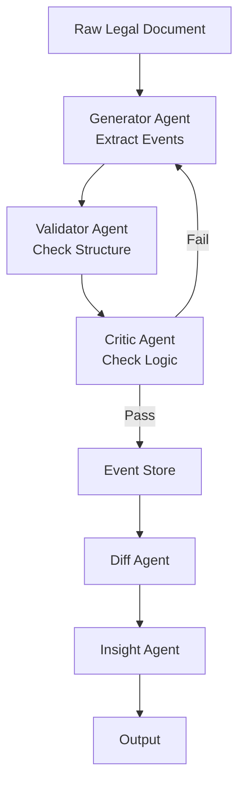

## StateConscious – Architecture Notes from Chat

These are cleaned notes from a chat about designing a system that tracks how laws change over time and explains their impact (working name: `StateConscious`).

---

## Problem Statement

- **Goal**: Build a system that tracks how laws and regulations change over time and explains their impact on specific users (by country, location, business, industry).
- **Constraints / requirements**:
  - **Periodic, not continuous**: Runs on a schedule (cron over official publications), not an endless agent loop.
  - **Long-term memory**: Does not "forget" context after weeks or many conversations.
  - **Version-aware**: Updates old laws when revised, and preserves history.
  - **Impact-focused**: Answers “who is affected and how?” rather than “what changed in line 42?”.

High-level analogy: **OpenClaw for law**, but with strong notions of **versioning, temporal correctness, and impact reasoning**.

---

## Key Reference Patterns

### Event Sourcing (core backbone)

- **Idea**: Store every change as an event, not just the latest state.
- **Example**:

```markdown
[2018] tax_rate = 17%
[2022] tax_rate = 18%
[2026] tax_rate = 20%
state = replay(events)
```

- **For laws**:
  - Laws, amendments, and repeals are all **events**.
  - This naturally handles:
    - “They updated the PDF silently.”
    - “What was true before date T?”

### Version Control Thinking (Git model)

- **Pattern to reuse**:
  - **Snapshot → diff → history**.
  - Every document = snapshot.
  - Every change = diff.
- Do **not** literally reimplement Git; just adopt the conceptual model.

### Knowledge Graph (for meaning)

- Raw diffs are not enough; you need structure like:
  - `SME → affected_by → tax_increase`
  - `tax_increase → magnitude → 3%`
- Because the user-facing questions are:
  - “**Who is affected?**”
  - not “what line changed?”.

### Why a generic agent loop (e.g. OpenClaw) is insufficient

- Typical agent loops are:
  - **Stateless-ish**
  - **Prompt-driven**
  - **Not built for long-term truth**
- They tend to:
  - forget earlier versions,
  - overwrite understanding,
  - hallucinate continuity.
- You need an **explicit memory structure**:

```markdown
[Sources]
   ↓
[Ingestion]
   ↓
[Event Extractor]  ← LLM
   ↓
[Event Store]      ← core DB (append-only)
   ↓
[State Builder]    ← replay events
   ↓
[Diff Engine]
   ↓
[Insight Generator] ← LLM
```

---

## Quant Analogy – Point-in-Time Data Systems

The closest mature analogue is **quant finance pipelines** that handle SEC filings and investor-relations updates.

### What quants have already solved

- **Messy filings → structured, time-aware state**.
- Core concept: **Point-in-time data**.
  - At any timestamp \(T\), you must know **what was known at that time**.
  - Avoids:
    - lookahead bias,
    - overwritten “truth”,
    - silent revisions.

### Typical quant pipeline

- **1. Ingestion (robust, redundant)**:
  - Sources: SEC EDGAR, company IR sites, data vendors.
  - Never rely on a single source or format.
- **2. Parsing**:
  - Don’t just store raw PDFs.
  - Extract structured items: revenue, EPS, guidance, segments.
  - Techniques: XBRL, regex/rules, increasingly LLMs.
- **3. Normalization**:
  - Map heterogeneous labels:
    - “Net income” vs “Profit attributable” → `"metric": "net_income"`.
- **4. Versioning (critical)**:

```json
{
  "reported_at": "2026-04-01",
  "effective_period": "Q1 2026",
  "value": 100
}
{
  "reported_at": "2026-05-10",
  "effective_period": "Q1 2026",
  "value": 95
}
```

- Both versions are kept.
- **5. Event layer**:
  - `earnings_released`, `guidance_updated`, `restatement_issued`, etc.
- **6. State reconstruction**:
  - Compute “latest known truth at time T”.

### As-reported vs As-known

- **As-reported**: what the issuer originally said.
- **As-known**: what we know after later revisions.
- Example:

```markdown
April: revenue = 100
May (revision): revenue = 95
```

Your system must support **both views**, which map well to law:

| Finance           | Law                     |
| ----------------- | ---------------------- |
| earnings report   | bill / act             |
| restatement       | amendment              |
| guidance update   | regulatory change      |
| filing date       | publication date       |
| effective period  | enforcement period/date|

### How quants handle “site breaking”

- **Assume everything will break**:
  - **Snapshot everything** (immutable copies of filings).
  - **Multiple ingestion paths** (APIs, mirrors, vendors).
  - **Schema evolution** (fields can change over time).
  - **Data quality checks** (e.g. revenue suddenly = 0 → flag).

### Directly reusable ideas for StateConscious

- **Point-in-time correctness**:
  - Never answer “what is the law?”.
  - Always answer “what was the law at time T?”.
- **Dual timestamps** for each record:

```json
{
  "published_at": "...",
  "effective_at": "..."
}
```

- **Immutable data**: never overwrite; always append.
- **Event-based modeling**: everything is a change event.
- **Backfill + incremental updates**:
  - Initial historical load, then daily (or periodic) updates.

### Where law is harder than finance

- **No XBRL equivalent**: many laws are unstructured PDFs.
- **Ambiguity**:
  - Finance: mostly numbers.
  - Law: language and interpretation.
- **Impact is implicit**:
  - Finance: `revenue = 95` is explicit.
  - Law: “impact” must be inferred from text and context.

---

## Proposed StateConscious Architecture

### High-level system (StateConscious core loop)

```mermaid
flowchart TD
    A[Legal Sources<br/>(PDF, HTML, Gazette)] --> B[Ingestion Layer]
    B --> C[Snapshot Store<br/>(Immutable Raw Docs)]
    C --> D[Event Extractor<br/>(LLM Structured Output)]
    D --> E[Event Store<br/>(Append Only)]
    E --> F[State Builder<br/>(Reconstruct World State)]
    F --> G[Diff Engine<br/>(What Changed?)]
    G --> H[Insight Generator<br/>(Impact + Stakeholders)]
    H --> I[Output Layer<br/>(Tweets / Reports / APIs)]
```

### Event sourcing model (core truth system)



### Point-in-time correctness (quant pattern)

```mermaid
flowchart TD
    A[Event 1<br/>published_at: Jan<br/>effective_at: Feb] --> D[Event Store]
    B[Event 2<br/>published_at: Mar<br/>effective_at: Apr] --> D
    C[Event 3<br/>revision<br/>published_at: May<br/>effective_at: Feb] --> D

    D --> E[State at Time T]

    E --> F[As-Known View<br/>(what we knew at T)]
    E --> G[As-Effective View<br/>(what was in force at T)]
```

### Versioning and diff detection

```mermaid
flowchart TD
    A[Fetch Document URL] --> B[Compute Hash]

    B -->|Same Hash| C[No Change]
    B -->|Different Hash| D[New Version]

    D --> E[Store Snapshot]
    E --> F[Compute Diff<br/>(old vs new)]
    F --> G[Classify Change<br/>(semantic / formatting)]
    G --> H[Emit Event]
```

### Multi-agent verification loop



---

## Data Flow and Schemas

Think in **transformational layers**:

```markdown
Raw Document → Segments → Semantic Units → Weak Structure → Strong Structure → State → Diff → Insights
```

### Layer 0 – Raw Document (input)

Example crawled bill PDF represented as JSON:

```json
{
  "source_url": "https://parliament.gov.my/bill123.pdf",
  "fetched_at": "2026-04-03T10:00:00Z",
  "document_type": "bill",
  "title": "Income Tax (Amendment) Bill 2026",
  "raw_text": "Section 2: The tax rate for small and medium enterprises shall be increased from 17 percent to 20 percent effective from 1 January 2027..."
}
```

### Layer 1 – Document Segmentation

Split the raw text into logical chunks (sections/clauses).

```json
[
  {
    "segment_id": "seg_001",
    "source_url": "https://parliament.gov.my/bill123.pdf",
    "section": "Section 2",
    "text": "The tax rate for small and medium enterprises shall be increased from 17 percent to 20 percent effective from 1 January 2027",
    "page": 3
  },
  {
    "segment_id": "seg_002",
    "source_url": "https://parliament.gov.my/bill123.pdf",
    "section": "Section 3",
    "text": "A new exemption applies to startups with revenue below RM500,000",
    "page": 4
  }
]
```

Output name: **`document_segments`**.

### (Original) Layer 2 – Structured Event Extraction (rigid)

Initial idea (useful for thinking, but too rigid as a first implementation):

```json
[
  {
    "event_id": "evt_001",
    "segment_id": "seg_001",
    "event_type": "rate_change",
    "target_entity": "SME",
    "field": "tax_rate",
    "old_value": 0.17,
    "new_value": 0.20,
    "unit": "percentage",
    "effective_date": "2027-01-01",
    "confidence": 0.92
  },
  {
    "event_id": "evt_002",
    "segment_id": "seg_002",
    "event_type": "exemption_added",
    "target_entity": "startup",
    "condition": "revenue < 500000 MYR",
    "effective_date": "2027-01-01",
    "confidence": 0.85
  }
]
```

Design principles (if/when you move to this stage):

- **Atomic**: 1 event = 1 change.
- **Structured**: no free-form paragraphs.
- **Comparable**: capture old vs new when possible.

### Your Pushback – Why this is too rigid initially

- **Normalization is hard**:
  - Many valid interpretations of the same legal text.
  - Law is qualitative; not everything reduces cleanly to numbers/columns.
- **Schema brittleness**:
  - Column names/enums will grow and change over time.
  - Forcing everything into a fixed event schema risks:
    - Losing nuance,
    - Or getting stuck fighting edge cases.
- **Alternative**:
  - Use **RAG + embeddings** to make text **queryable and relatable**.
  - Split into summaries plus more generalized tables (e.g. industry, type of change), but don’t overcommit to rigid columns too early.

---

## Refined Design – Semantic-First, Structure-Later

Instead of jumping straight from segments to strict events:

```markdown
Raw → Segments → Semantic Units → Weak Structure → Strong Structure → Diff
```

### Layer 2 (redefined) – Semantic Extraction

- Don’t force `"event_type": "rate_change"` immediately.
- Extract **semantic units** with embeddings, tags, and loose attributes.

```json
[
  {
    "unit_id": "u_001",
    "segment_id": "seg_001",
    "text": "The tax rate for small and medium enterprises shall be increased from 17 percent to 20 percent effective from 1 January 2027",
    "embedding": "...",
    "tags": ["tax", "SME", "increase"],
    "attributes": {
      "subject": "small and medium enterprises",
      "action": "increase",
      "object": "tax rate",
      "value": "20 percent",
      "previous_value": "17 percent",
      "effective_date": "2027-01-01"
    },
    "confidence": 0.78
  }
]
```

Output name: **`semantic_units`**.

### Layer 3 – Interpretation (multiple views)

From the same semantic unit, derive different perspectives as needed:

```json
{
  "type": "numeric_change",
  "entity": "SME",
  "field": "tax_rate",
  "from": 0.17,
  "to": 0.20
}
```

```json
{
  "type": "policy_direction",
  "direction": "tightening",
  "target": "SMEs"
}
```

```json
{
  "type": "scope_change",
  "applies_to": "SMEs",
  "excludes": null
}
```

You can layer these as:

- **Numeric impact view**
- **Policy intent view**
- **Legal scope view**

### Stable vs unstable fields

- **Stable (good to structure)**:
  - Dates
  - Numbers
  - Entities (e.g. SME, bank, specific sectors)
  - Relationships (increase, exempt, repeal, etc.)
- **Unstable (keep semantic / embedding-based)**:
  - Intent
  - Interpretation
  - Legal nuance
  - Edge cases

---

## Updated End-to-End Pipeline

```mermaid
flowchart TD
    A[Raw Document] --> B[Segmentation]
    B --> C[Semantic Extraction<br/>(text + embeddings + loose attributes)]
    C --> D[Semantic Store]
    D --> E[Interpretation Layer<br/>(multiple views)]
    E --> F[Structured Events<br/>(optional / downstream)]
    F --> G[State + Diff]
    D --> H[RAG / Retrieval]
```

### Full pipeline (schema mapping)

```markdown
raw_document
   ↓
document_segments[]
   ↓
semantic_units[]
   ↓
optional_events[]
   ↓
state_snapshot
   ↓
diff
   ↓
insight
```

This gives you:

- A **semantic-first core** that is robust to schema changes.
- The option to **gradually harden** into more structured events where it pays off.
- Strong alignment with **event sourcing**, **point-in-time correctness**, and **impact-focused** outputs.

human:
how do i find reference or decide the right pattern to handle this problem? 

A system that tracks how laws change over time and explains their impact

think of an Openclaw that reads legal sources, then publishing the stakes for user by country, location, business, industry, that doesn't need to run forever, simply just cron the right publication sources, that doesn't forget context after 2 weeks or 200 conversation, that updates old laws when it gets revised

one obvious point to start is to fork openclaw, then manually feed it hundreds of legal transcripts and ask it bunch of questions until we run into the obvious problems. 

llm:
You’re very close—but your instinct to “fork OpenClaw + feed transcripts until it breaks” is only half the move.

That approach will teach you where LLMs fail.
It will not teach you the right architecture.

What you need is:

reference patterns from adjacent systems that already solved “evolving truth over time”

1. The MOST important reference: Event Sourcing

This is your backbone.

5
Idea:

Store every change as an event, not just the latest state

Instead of:

tax_rate = 20%

You store:

[2018] tax_rate = 17%
[2022] tax_rate = 18%
[2026] tax_rate = 20%

Then:

state = replay(events)

Why this matters for you
laws change → events
amendments → events
repeal → events

👉 This solves:

“they updated the PDF silently”
“what was true before?”

2. Version control thinking (Git model)

You already intuitively got this.

6

But don’t literally build Git.

Extract the pattern:

snapshot → diff → history


Key idea:

Every document = snapshot
Every change = diff

🧠 3. Knowledge graph (for meaning)

Raw diffs are not enough.

You need structure like:

SME → affected_by → tax_increase
tax_increase → magnitude → 3%

Why?

Because your output is:

“who is affected?”

Not:

“line 42 changed”


Why “just use OpenClaw” is insufficient

OpenClaw (and similar agent loops) are:

stateless-ish
prompt-driven
not built for long-term truth

They will:

❌ forget context
❌ overwrite understanding
❌ hallucinate continuity


Now extract:

what memory structure would prevent this failure?

Example:

LLM fails to remember old version →
👉 you need explicit version store

```
[Sources]
   ↓
[Ingestion]
   ↓
[Event Extractor]  ← LLM
   ↓
[Event Store]      ← your core DB
   ↓
[State Builder]    ← replay events
   ↓
[Diff Engine]
   ↓
[Insight Generator] ← LLM
```

Option A: documents

❌ bad (too messy)

Option B: summaries

❌ worse (lossy)

Option C: events (correct)

👉 Example:

event = {
  type: "tax_change",
  target: "SME",
  from: 17%,
  to: 20%,
  date: ...
}


Where to find GOOD references (not fluff)
1. Engineering patterns (high signal)

Search:

“event sourcing real world examples”
“temporal database design”
“slowly changing dimensions (SCD type 2)”

👉 These are directly relevant

2. Open datasets (for structure inspiration)
US Congress APIs
EU legislative data

Look at:

how they model:
versions
amendments
stages
3. Legal tech (but critically)

Most legal tech is:

search
compliance

But extract:

how they structure entities

You don’t discover the pattern by:

❌ reading more
❌ crawling more

You discover it by:

observing where unstructured reasoning breaks → then introducing structure

---

HUman:

i notice my problem is very similar to crawling sec filings and company investor relation sites and update my earnings table. how do quants handle this crawling problem? 

---

llm: 

You just hit a very powerful analogy—and yes, this is the closest mature field to what you’re building.

Quants already solved: messy filings → structured state → time-aware analysis


👉 “Point-in-Time Data System”

Key idea:

At any timestamp T, you must know what was known at that time

This avoids:

lookahead bias
overwritten truth
silent revisions


How quants structure the pipeline
1. Ingestion layer (robust, redundant)

Sources:

SEC EDGAR
company IR sites
data vendors

They NEVER rely on:

one source
one format

👉 redundancy is key


2. Parsing layer (structured extraction)

They don’t store:

raw PDFs only

They extract:

revenue
EPS
guidance
segments

Often using:

XBRL (structured format)
regex + rules
increasingly LLMs

3. Normalization layer

Different companies say:

“Net income”
“Profit attributable”

👉 normalize into:

{
  "metric": "net_income",
  "value": 123456
}


4. Versioning layer (CRITICAL)

They store:

{
  "reported_at": "2026-04-01",
  "effective_period": "Q1 2026",
  "value": 100
}

If later revised:

{
  "reported_at": "2026-05-10",
  "effective_period": "Q1 2026",
  "value": 95
}

👉 both are kept


5. Event layer

Everything becomes:

events

Example:

earnings released
guidance updated
restatement issued


6. State reconstruction

They compute:

“latest known truth at time T”


🧠 The MOST important concept they use
👉 “As-reported vs As-known”
As-reported:

what the company originally said

As-known:

what we know after revisions
Example:
Date	Revenue
April	100
May (revision)	95

👉 Your system must support BOTH


⚠️ This maps EXACTLY to your law problem
Finance	Law
earnings report	bill / act
restatement	amendment
guidance update	regulatory change
filing date	publication date
effective period	enforcement date


🔥 What quants do about “site breaking”

They assume:

everything will break

Techniques:
✅ Snapshot everything
every filing saved
immutable
✅ Multiple ingestion paths
EDGAR API
mirrors
vendors
✅ Schema evolution
fields change over time
system adapts


✅ Data quality checks

Example:

revenue suddenly = 0 → flag
🧠 What you should steal directly


🧠 What you should steal directly
1. Point-in-time correctness

Never answer:

“what is the law?”

Always answer:

“what was the law at time T?”


2. Dual timestamps

Every record has:

{
  "published_at": "...",
  "effective_at": "..."
}
3. Immutable data

Never overwrite.

4. Event-based modeling

Everything = change event

5. Backfill + incremental updates
initial historical load
then daily updates

⚡ Where your system is HARDER than quants

Be aware:

1. No XBRL equivalent

Finance has:

structured filings (XBRL)

Law has:

PDFs 😄
2. Ambiguity

Finance:

numbers

Law:

language + interpretation

3. “Impact” is not explicit

Finance:

revenue = number

Law:

“impact” must be inferred


The correct pattern for you (adapted from quants)
Your version:
[Sources]
   ↓
[Snapshot Store]        ← raw docs
   ↓
[Event Extractor]       ← LLM
   ↓
[Event Store]           ← structured changes
   ↓
[State Builder]         ← point-in-time state
   ↓
[Insight Layer]         ← impact reasoning


🧠 1. High-level system (StateConscious core loop)

flowchart TD
    A[Legal Sources\n(PDF, HTML, Gazette)] --> B[Ingestion Layer]
    B --> C[Snapshot Store\n(Immutable Raw Docs)]
    C --> D[Event Extractor\n(LLM Structured Output)]
    D --> E[Event Store\n(Append Only)]
    E --> F[State Builder\n(Reconstruct World State)]
    F --> G[Diff Engine\n(What Changed?)]
    G --> H[Insight Generator\n(Impact + Stakeholders)]
    H --> I[Output Layer\n(Tweets / Reports)]

🔥 2. Event sourcing model (core truth system)
flowchart LR
    A[Raw Document v1] --> B[Extract Event]
    C[Raw Document v2] --> D[Extract Event]

    B --> E[Event Store]
    D --> E

    E --> F[Replay Events]
    F --> G[Current State]

    E --> H[Diff Engine]
    H --> I[Change Output]

🕒 3. Point-in-time correctness (quant pattern)

flowchart TD
    A[Event 1\npublished_at: Jan\neffective_at: Feb] --> D[Event Store]
    B[Event 2\npublished_at: Mar\neffective_at: Apr] --> D
    C[Event 3\nrevision\npublished_at: May\neffective_at: Feb] --> D

    D --> E[State at Time T]

    E --> F[As-Known View\n(what we knew at T)]
    E --> G[As-Effective View\n(what was in force at T)]

🔄 4. Versioning + diff detection

flowchart TD
    A[Fetch Document URL] --> B[Compute Hash]

    B -->|Same Hash| C[No Change]
    B -->|Different Hash| D[New Version]

    D --> E[Store Snapshot]
    E --> F[Compute Diff\n(old vs new)]
    F --> G[Classify Change\n(semantic / formatting)]
    G --> H[Emit Event]

🧠 6. Multi-agent verification loop (your vibe system)

flowchart TD
    A[Raw Legal Document] --> B[Generator Agent\nExtract Events]

    B --> C[Validator Agent\nCheck Structure]
    C --> D[Critic Agent\nCheck Logic]

    D -->|Fail| B
    D -->|Pass| E[Event Store]

    E --> F[Diff Agent]
    F --> G[Insight Agent]

    G --> H[Output]

---

Human: 

can we draft the example input and the expected schema, then the output schemas? suppose we get a pdf of a bill, i imagine we need to slice it up to multiple rows or record, and it may need a couple of layers to parse them into multiple records

---

llm:

You’re also correct:

one PDF ≠ one record
one PDF → many structured events across multiple layers

Let’s design this cleanly.


First: the layering (don’t skip this)

Think in 3 transformation layers:

Raw Document → Segments → Structured Events → State → Insights


1. Example INPUT (realistic)

Suppose you crawl a bill PDF:

{
  "source_url": "https://parliament.gov.my/bill123.pdf",
  "fetched_at": "2026-04-03T10:00:00Z",
  "document_type": "bill",
  "title": "Income Tax (Amendment) Bill 2026",
  "raw_text": "Section 2: The tax rate for small and medium enterprises shall be increased from 17 percent to 20 percent effective from 1 January 2027..."
}

2. Layer 1 — Document Segmentation

You MUST split into logical chunks.

Output: document_segments
[
  {
    "segment_id": "seg_001",
    "section": "Section 2",
    "text": "The tax rate for small and medium enterprises shall be increased from 17 percent to 20 percent effective from 1 January 2027",
    "page": 3
  },
  {
    "segment_id": "seg_002",
    "section": "Section 3",
    "text": "A new exemption applies to startups with revenue below RM500,000",
    "page": 4
  }
]


7. Full pipeline (mapping schemas together)
raw_document
   ↓
document_segments[]
   ↓
events[]
   ↓
state_snapshot
   ↓
diff
   ↓
insight

---

human: 

3. Layer 2 — Structured Event Extraction (CORE)

Each segment → possibly multiple events

Output: events
[
  {
    "event_id": "evt_001",
    "segment_id": "seg_001",
    "event_type": "rate_change",
    "target_entity": "SME",
    "field": "tax_rate",
    "old_value": 0.17,
    "new_value": 0.20,
    "unit": "percentage",
    "effective_date": "2027-01-01",
    "confidence": 0.92
  },
  {
    "event_id": "evt_002",
    "segment_id": "seg_002",
    "event_type": "exemption_added",
    "target_entity": "startup",
    "condition": "revenue < 500000 MYR",
    "effective_date": "2027-01-01",
    "confidence": 0.85

Design principles here
atomic (1 event = 1 change)

i want to push back on this pattern. i realize the normalization layer is very hard, as there are multiple interpretation. you are assuming the qualitative nature of law and words can be reduced to quantification. we might need to use rag and embeddings to reduce the text into something querable and relatable, or even to be categorizable without relyign on column names. 

we can split the bill and transcripts into summary, and perhaps append another more generalized table for industry and changes. but the columns are unlikely to be some nice with enums that wont grow or change over time. 
structured (no paragraphs)
comparable (old vs new when possible)

---

llm: 

This is a very good pushback—and you’re right to challenge it.

The “clean event schema” I gave you is too rigid as a first move.
If you force structure too early, you’ll either:

lose nuance
or spend forever fighting edge cases

The better architecture (refined)

Instead of jumping straight to “events”:

Raw → Segments → Semantic Units → Weak Structure → Strong Structure → Diff


Layer 2 (redefined): Semantic Extraction (not strict events)

Don’t force:

❌ "event_type": "rate_change"

Instead extract:

Output: semantic_units
[
  {
    "unit_id": "u_001",
    "segment_id": "seg_001",
    "text": "The tax rate for small and medium enterprises shall be increased from 17 percent to 20 percent effective from 1 January 2027",
    "embedding": "...",
    "tags": ["tax", "SME", "increase"],
    "attributes": {
      "subject": "small and medium enterprises",
      "action": "increase",
      "object": "tax rate",
      "value": "20 percent",
      "previous_value": "17 percent",
      "effective_date": "2027-01-01"
    },
    "confidence": 0.78
  }
]


Layer 3: Interpretation (multiple possible views)

From the same semantic unit:

You can derive:

View 1: Financial impact
{
  "type": "numeric_change",
  "entity": "SME",
  "field": "tax_rate",
  "from": 0.17,
  "to": 0.20
}

View 2: Policy intent
{
  "type": "policy_direction",
  "direction": "tightening",
  "target": "SMEs"
}

View 3: Legal scope
{
  "type": "scope_change",
  "applies_to": "SMEs",
  "excludes": null
}


What is stable vs unstable?
Stable (structure these)
dates
numbers
entities (SME, bank, etc.)
relationships (increase, exempt

Unstable (keep semantic)
intent
interpretation
legal nuance
edge cases


🔄 Updated pipeline (your improved version)

flowchart TD
    A[Raw Document] --> B[Segmentation]

    B --> C[Semantic Extraction\n(text + embeddings + loose attributes)]

    C --> D[Semantic Store]

    D --> E[Interpretation Layer\n(multiple views)]

    E --> F[Structured Events\n(optional)]

    F --> G[State + Diff]

    D --> H[RAG / Retrieval]


