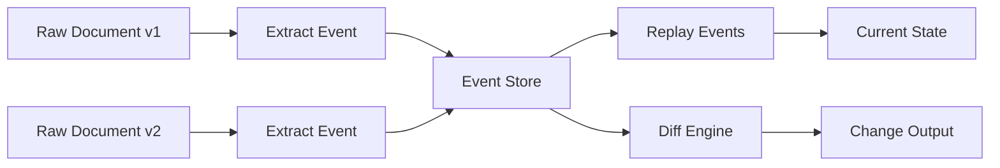
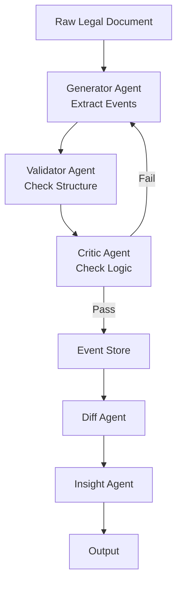

# Chat log – law tracking / StateConscious (organized)

Raw roles preserved as **Human** / **LLM** per turn. Code and diagrams are in fenced blocks.

---

## Turn 1

### Human

how do i find reference or decide the right pattern to handle this problem?

A system that tracks how laws change over time and explains their impact

think of an Openclaw that reads legal sources, then publishing the stakes for user by country, location, business, industry, that doesn't need to run forever, simply just cron the right publication sources, that doesn't forget context after 2 weeks or 200 conversation, that updates old laws when it gets revised

one obvious point to start is to fork openclaw, then manually feed it hundreds of legal transcripts and ask it bunch of questions until we run into the obvious problems.

### LLM

You’re very close—but your instinct to “fork OpenClaw + feed transcripts until it breaks” is only half the move.

That approach will teach you where LLMs fail. It will not teach you the right architecture.

What you need is reference patterns from adjacent systems that already solved “evolving truth over time”.

**1. The MOST important reference: Event Sourcing** — This is your backbone.

Idea: Store every change as an event, not just the latest state.

Instead of `tax_rate = 20%`, you store something like:

```text
[2018] tax_rate = 17%
[2022] tax_rate = 18%
[2026] tax_rate = 20%
state = replay(events)
```

Why this matters: laws change → events; amendments → events; repeal → events. This helps with “they updated the PDF silently” and “what was true before?”.

**2. Version control thinking (Git model)** — Don’t literally build Git. Pattern: snapshot → diff → history. Every document = snapshot; every change = diff.

**3. Knowledge graph (for meaning)** — Raw diffs are not enough; you need structure like `SME → affected_by → tax_increase`, `tax_increase → magnitude → 3%`, because your output is “who is affected?” not “line 42 changed”.

**Why “just use OpenClaw” is insufficient** — Agent loops tend to be stateless-ish, prompt-driven, not built for long-term truth; they may forget context, overwrite understanding, hallucinate continuity.

Memory structure example:

```text
[Sources]
   ↓
[Ingestion]
   ↓
[Event Extractor]  ← LLM
   ↓
[Event Store]      ← your core DB
   ↓
[State Builder]    ← replay events
   ↓
[Diff Engine]
   ↓
[Insight Generator] ← LLM
```

Options: documents ❌ messy; summaries ❌ lossy; events ✅ (example below).

```js
event = {
  type: "tax_change",
  target: "SME",
  from: 17%,
  to: 20%,
  date: ...
}
```

**References:** search “event sourcing real world examples”, “temporal database design”, “slowly changing dimensions (SCD type 2)”; US Congress APIs / EU legislative data for versions, amendments, stages; legal tech for entity structure — discover patterns where unstructured reasoning breaks, then add structure.

---

## Turn 2

### Human

i notice my problem is very similar to crawling sec filings and company investor relation sites and update my earnings table. how do quants handle this crawling problem?

### LLM

You just hit a very powerful analogy—closest mature field: messy filings → structured state → time-aware analysis.

**Point-in-Time Data System:** At timestamp T, know what was known at T. Avoids lookahead bias, overwritten truth, silent revisions.

**Pipeline:** (1) Ingestion — EDGAR, IR, vendors; redundancy. (2) Parsing — not raw PDF only; revenue, EPS, guidance, segments; XBRL, regex/rules, LLMs. (3) Normalization — e.g. “Net income” vs “Profit attributable” → one metric. (4) Versioning — keep both original and revised rows. (5) Events — earnings released, guidance updated, restatement. (6) State — “latest known truth at time T”.

**As-reported vs As-known** — support both (e.g. April 100 → May revision 95).

Finance / law mapping: earnings report → bill/act; restatement → amendment; guidance update → regulatory change; filing date → publication date; effective period → enforcement date.

**Site breaking:** assume failure; snapshot everything; multiple paths; schema evolution; data quality checks.

**Steal:** point-in-time answers (“what was the law at T?”); dual timestamps `published_at` / `effective_at`; immutable append; events; backfill + incremental updates.

**Harder than quants:** no XBRL for law; ambiguity; impact must be inferred.

Adapted pipeline:

```text
[Sources]
   ↓
[Snapshot Store]        ← raw docs
   ↓
[Event Extractor]       ← LLM
   ↓
[Event Store]           ← structured changes
   ↓
[State Builder]         ← point-in-time state
   ↓
[Insight Layer]         ← impact reasoning
```

**Mermaid – high-level system**

```mermaid
flowchart TD
    A[Legal Sources\n(PDF, HTML, Gazette)] --> B[Ingestion Layer]
    B --> C[Snapshot Store\n(Immutable Raw Docs)]
    C --> D[Event Extractor\n(LLM Structured Output)]
    D --> E[Event Store\n(Append Only)]
    E --> F[State Builder\n(Reconstruct World State)]
    F --> G[Diff Engine\n(What Changed?)]
    G --> H[Insight Generator\n(Impact + Stakeholders)]
    H --> I[Output Layer\n(Tweets / Reports)]
```

**Mermaid – event sourcing**



**Mermaid – point-in-time**

```mermaid
flowchart TD
    A[Event 1\npublished_at: Jan\neffective_at: Feb] --> D[Event Store]
    B[Event 2\npublished_at: Mar\neffective_at: Apr] --> D
    C[Event 3\nrevision\npublished_at: May\neffective_at: Feb] --> D
    D --> E[State at Time T]
    E --> F[As-Known View\n(what we knew at T)]
    E --> G[As-Effective View\n(what was in force at T)]
```

**Mermaid – versioning / diff**

```mermaid
flowchart TD
    A[Fetch Document URL] --> B[Compute Hash]
    B -->|Same Hash| C[No Change]
    B -->|Different Hash| D[New Version]
    D --> E[Store Snapshot]
    E --> F[Compute Diff\n(old vs new)]
    F --> G[Classify Change\n(semantic / formatting)]
    G --> H[Emit Event]
```

**Mermaid – multi-agent loop**



**Versioning JSON example (LLM text):**

```json
{
  "reported_at": "2026-04-01",
  "effective_period": "Q1 2026",
  "value": 100
}
```

```json
{
  "reported_at": "2026-05-10",
  "effective_period": "Q1 2026",
  "value": 95
}
```

```json
{
  "published_at": "...",
  "effective_at": "..."
}
```

---

## Turn 3

### Human

can we draft the example input and the expected schema, then the output schemas? suppose we get a pdf of a bill, i imagine we need to slice it up to multiple rows or record, and it may need a couple of layers to parse them into multiple records

### LLM

one PDF ≠ one record; one PDF → many structured events across layers.

Layers: Raw Document → Segments → Structured Events → State → Insights.

**Example INPUT (bill PDF metadata + text):**

```json
{
  "source_url": "https://parliament.gov.my/bill123.pdf",
  "fetched_at": "2026-04-03T10:00:00Z",
  "document_type": "bill",
  "title": "Income Tax (Amendment) Bill 2026",
  "raw_text": "Section 2: The tax rate for small and medium enterprises shall be increased from 17 percent to 20 percent effective from 1 January 2027..."
}
```

**Layer 1 — `document_segments`:**

```json
[
  {
    "segment_id": "seg_001",
    "section": "Section 2",
    "text": "The tax rate for small and medium enterprises shall be increased from 17 percent to 20 percent effective from 1 January 2027",
    "page": 3
  },
  {
    "segment_id": "seg_002",
    "section": "Section 3",
    "text": "A new exemption applies to startups with revenue below RM500,000",
    "page": 4
  }
]
```

**Full pipeline (text):**

```text
raw_document
   ↓
document_segments[]
   ↓
events[]
   ↓
state_snapshot
   ↓
diff
   ↓
insight
```

---

## Turn 4

### Human

3. Layer 2 — Structured Event Extraction (CORE). Each segment → possibly multiple events.

Output: `events`:

```json
[
  {
    "event_id": "evt_001",
    "segment_id": "seg_001",
    "event_type": "rate_change",
    "target_entity": "SME",
    "field": "tax_rate",
    "old_value": 0.17,
    "new_value": 0.20,
    "unit": "percentage",
    "effective_date": "2027-01-01",
    "confidence": 0.92
  },
  {
    "event_id": "evt_002",
    "segment_id": "seg_002",
    "event_type": "exemption_added",
    "target_entity": "startup",
    "condition": "revenue < 500000 MYR",
    "effective_date": "2027-01-01",
    "confidence": 0.85
  }
]
```

Design principles (from thread): atomic (1 event = 1 change); structured (no paragraphs); comparable (old vs new when possible).

**Pushback:** normalization is hard — multiple interpretations; law is qualitative and may not reduce to quantification; may need RAG/embeddings for queryable text without rigid column enums; summaries + generalized industry/change tables; columns/enums will grow.

### LLM

Pushback is valid — “clean event schema” too rigid as first move; forcing structure early loses nuance or creates endless edge cases.

**Refined path:** Raw → Segments → Semantic Units → Weak Structure → Strong Structure → Diff.

**Layer 2 redefined — `semantic_units`:**

```json
[
  {
    "unit_id": "u_001",
    "segment_id": "seg_001",
    "text": "The tax rate for small and medium enterprises shall be increased from 17 percent to 20 percent effective from 1 January 2027",
    "embedding": "...",
    "tags": ["tax", "SME", "increase"],
    "attributes": {
      "subject": "small and medium enterprises",
      "action": "increase",
      "object": "tax rate",
      "value": "20 percent",
      "previous_value": "17 percent",
      "effective_date": "2027-01-01"
    },
    "confidence": 0.78
  }
]
```

**Layer 3 — interpretation views (examples):**

```json
{
  "type": "numeric_change",
  "entity": "SME",
  "field": "tax_rate",
  "from": 0.17,
  "to": 0.20
}
```

```json
{
  "type": "policy_direction",
  "direction": "tightening",
  "target": "SMEs"
}
```

```json
{
  "type": "scope_change",
  "applies_to": "SMEs",
  "excludes": null
}
```

**Stable vs unstable:** Stable — dates, numbers, entities, relationships. Unstable — intent, interpretation, nuance, edge cases (keep semantic).

**Updated pipeline (mermaid):**

```mermaid
flowchart TD
    A[Raw Document] --> B[Segmentation]
    B --> C[Semantic Extraction\n(text + embeddings + loose attributes)]
    C --> D[Semantic Store]
    D --> E[Interpretation Layer\n(multiple views)]
    E --> F[Structured Events\n(optional)]
    F --> G[State + Diff]
    D --> H[RAG / Retrieval]
```
