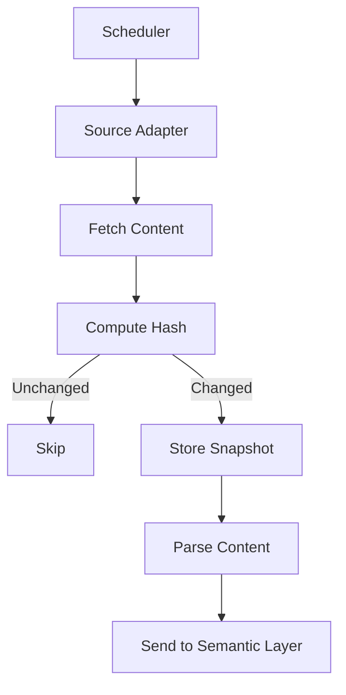

## Step 1

### Human

I did not create saves/gate-1-idea-approved.md yet—per your game rules, that needs your explicit Gate 1 approval.

Gate 1 (your turn)
Reply with one of:

“Approve Gate 1” — I’ll add saves/gate-1-idea-approved.md and set 00-state.md for Phase 2, or
Edits — e.g. pick the exact first source URL and one domain (bill family vs statute), and I’ll fold them into PRD + variables before you sign off.

ok, this is my problem now. where do i find legal updates? is there an api i can use, or a site i can crawl? 

do i create a lib/crawl/{siteName} to manage each site crawling rules and run cron for everything in lib/crawl everyday? 

### LLM

You’re asking the *right* operational question now:

> “Where does the data actually come from, and how do I not build a fragile mess?”

Let’s ground this in reality—because this is where most projects quietly die.

---

# 🧠 First: there is no “one API to rule them all”

Unlike finance (SEC/XBRL), legal data is:

* fragmented
* inconsistent
* sometimes hostile to automation

So your system must assume:

> **multiple sources, multiple formats, zero guarantees**

---

# 🔗 1. Where to get legal updates (Malaysia-first, practical)

## 🇲🇾 Tier 1 (authoritative, MUST use)

### 1. Attorney General's Chambers of Malaysia

* publishes **Federal Gazette (laws, amendments)**
* this is the **ground truth**

👉 Problem:

* often PDF
* sometimes not cleanly structured

---

### 2. Parliament of Malaysia

* bills, order papers, Hansard

👉 Problem:

* navigation is painful
* inconsistent formats

---

## 🇲🇾 Tier 2 (cleaner, easier wins)

### 3. Bank Negara Malaysia

### 4. Securities Commission Malaysia

👉 These:

* publish circulars, guidelines
* MUCH easier to parse
* high economic impact

---

# 🌍 Optional (for learning patterns)

* U.S. Congress → has APIs
* European Parliament

👉 Not for production, but for:

* schema inspiration
* workflow understanding

---

# ⚠️ Reality check: APIs?

## Malaysia:

❌ No clean unified API
❌ No stable schema

## Some countries:

* US: yes (congress.gov API)
* UK: partial
* EU: partial

👉 But even there:

> you STILL need crawling + normalization

---

# 🧠 So what’s the correct ingestion strategy?

---

# 🔥 2. Yes—but refine your idea

You proposed:

```text
lib/crawl/{siteName}
cron everything daily
```

This is **directionally correct**, but incomplete.

---

# ⚙️ Correct pattern: “Source adapters”

Instead of “crawler”, think:

## 👉 **source adapters**

---

## Folder structure (refined)

```bash
lib/
  sources/
    parliament_my/
      fetch.ts
      parse.ts
      config.ts

    agc_gazette/
      fetch.ts
      parse.ts

    bnm/
      fetch.ts
      parse.ts
```

---

## Why this matters

Each source has:

* different HTML
* different PDF structure
* different update patterns

👉 You isolate chaos per source

---

# 🔄 3. Scheduler pattern (cron, but smarter)

Don’t just:

❌ “run everything daily”

---

## Instead:

```text
scheduler → source adapter → fetch → detect change → process
```

---

## Example logic:

```ts
for (source of sources) {
  if (source.shouldFetchToday()) {
    run(source.fetch)
  }
}
```

---

## Different frequencies:

| Source     | Frequency |
| ---------- | --------- |
| Parliament | daily     |
| Gazette    | daily     |
| BNM        | weekly    |
| SC         | weekly    |

---

# 🧠 4. The MOST important part (you’re missing this)

## 👉 Change detection BEFORE parsing

---

## Flow:

```text
fetch → hash → compare → IF changed → parse
```

---

## Why?

* saves cost
* avoids reprocessing
* prevents duplicate events

---

# 🧱 5. Minimal ingestion schema (you need this early)

```json
{
  "source": "parliament_my",
  "url": "...",
  "fetched_at": "...",
  "content_hash": "...",
  "raw_content_path": "...",
  "status": "new | unchanged | updated"
}
```

---

# 🔥 6. What your V1 should ACTUALLY do

Don’t start with:

* 10 sources
* global coverage

---

## Start with ONE:

👉 Best choice:

**Bank Negara Malaysia**

Why:

* structured-ish
* consistent updates
* high signal

---

# ⚠️ Common mistake (avoid this)

You might think:

> “more sources = better system”

Wrong.

👉 More sources = exponential complexity

---

# 🧠 7. Long-term pattern (important)

Eventually you will have:

```text
sources → adapters → ingestion queue → processing pipeline
```

But for V1:

👉 keep it simple:

* no queue
* no distributed system
* just cron + local processing

---

# 🔧 8. Practical stack suggestion (minimal)

* cron (or node scheduler)
* simple fetch (axios / fetch)
* HTML parser (cheerio)
* PDF parser (pdf-parse or similar)
* local storage (files or simple DB)

---

# 🧭 Final architecture (your ingestion layer)



---

# ⚡ What you should do NOW (before Gate 1 approval)

To unblock yourself:

---

## Step 1 (very important)

Pick ONE:

* Bank Negara OR
* Parliament bills

---

## Step 2

Find:

* 2–3 real URLs
* manually inspect structure

---

## Step 3

Answer this:

> “How do I detect new documents from this site?”

That’s your real ingestion problem.

---

# 🧠 Final insight

You are not building:

> a crawler

You are building:

> **a system that continuously detects change in institutional outputs**

---

If you want, next I can:

* help you pick the **best first source (with real URLs)**
* or design your **first `source adapter` implementation step-by-step**

---
---


